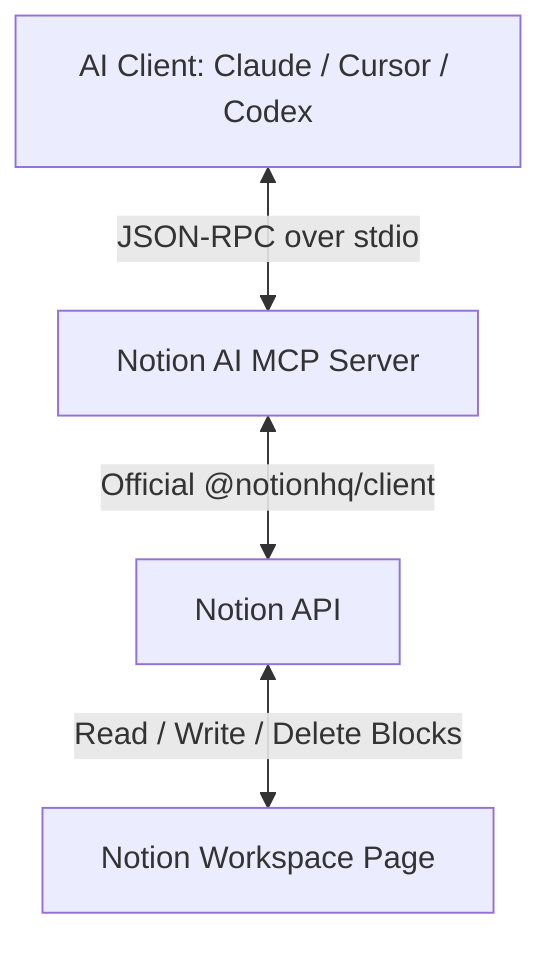

# Notion AI MCP Server 🚀

[](https://github.com/knguyen1411b/notion-mcp/actions/workflows/ci.yml)
[](https://opensource.org/licenses/MIT)
[](https://modelcontextprotocol.io)
[](https://github.com/knguyen1411b/notion-mcp/pulls)

An implementation of the **Model Context Protocol (MCP)** for Notion. This server allows AI assistants (such as Claude Desktop, Cursor, Codex, or other MCP clients) to directly read, write, and restructure content on your Notion pages.

Bản tiếng Việt có ở phần sau của tài liệu.

---

## Architecture / Kiến trúc



---

## English Version

### Features & Tools Exposed

1.  **`notion_test_connection`**
    *   **Description:** Verifies integration credentials and checks connection to a Notion page.
    *   **Arguments:**
        *   `apiKey` (optional, string): Notion integration token. Defaults to `NOTION_API_KEY` env.
        *   `pageId` (optional, string): Notion Page ID or URL. Defaults to `NOTION_PAGE_ID` env.
2.  **`notion_get_page_content`**
    *   **Description:** Recursively fetches child blocks of a Notion page and renders them as Markdown.
    *   **Arguments:**
        *   `apiKey` (optional, string)
        *   `pageId` (optional, string)
3.  **`notion_update_section`**
    *   **Description:** Searches for a heading on a page, deletes its children blocks, and overwrites with new Markdown content.
    *   **Arguments:**
        *   `headerQuery` (required, string): Query string to find the heading (case-insensitive).
        *   `markdownContent` (required, string): New Markdown content to write.
        *   `apiKey` (optional, string)
        *   `pageId` (optional, string)
4.  **`notion_append_content`**
    *   **Description:** Appends Markdown content directly to the end of a Notion page.
    *   **Arguments:**
        *   `markdownContent` (required, string): Markdown content to append.
        *   `apiKey` (optional, string)
        *   `pageId` (optional, string)

### Getting Started

#### Prerequisites
*   **Node.js** (v18+)
*   **pnpm** (v9+ or v11+)
*   **Notion Integration Token:** Create one at [Notion Developers](https://www.notion.so/my-integrations).
*   **Notion Page ID:** Ensure you have shared your Notion page with the integration.

#### Installation
1.  Clone this repository.
2.  Install dependencies:
    ```bash
    pnpm install
    ```
3.  Copy `.env.example` to `.env` and fill in your keys:
    ```bash
    cp .env.example .env
    ```
4.  Build the project:
    ```bash
    pnpm build
    ```

#### Configuration for MCP Clients

##### 1. Claude Desktop
Add this to your `claude_desktop_config.json` (found in `%APPDATA%\Claude\claude_desktop_config.json` on Windows):
```json
{
  "mcpServers": {
    "notion-ai-mcp": {
      "command": "node",
      "args": ["D:/WorkSpace/Projects/notion-ai/dist/index.js"],
      "env": {
        "NOTION_API_KEY": "your_notion_api_key",
        "NOTION_PAGE_ID": "your_notion_page_id"
      }
    }
  }
}
```
*(Adjust the path in `args` to match where you cloned the repository).*

##### 2. Cursor
Go to **Settings** > **Features** > **MCP** and click **+ Add New MCP Server**:
*   **Name:** `Notion AI MCP`
*   **Type:** `stdio`
*   **Command:** `node D:/WorkSpace/Projects/notion-ai/dist/index.js`

##### 3. Codex
You can add it via Codex CLI:
```bash
codex mcp add notion-ai-mcp --node D:/WorkSpace/Projects/notion-ai/dist/index.js
```
Or insert this into your `~/.codex/config.toml` config file:
```toml
[mcp.servers.notion-ai-mcp]
command = "node"
args = ["D:/WorkSpace/Projects/notion-ai/dist/index.js"]

[mcp.servers.notion-ai-mcp.env]
NOTION_API_KEY = "your_notion_api_key"
NOTION_PAGE_ID = "your_notion_page_id"
```

---

## Bản Tiếng Việt

Tích hợp giao thức **Model Context Protocol (MCP)** cho Notion. Server này cho phép các trợ lý AI (như Claude Desktop, Cursor, Codex, v.v.) trực tiếp đọc, viết và cấu trúc lại nội dung trên trang Notion của bạn.

### Các công cụ (Tools) được cung cấp

1.  **`notion_test_connection`**
    *   **Mô tả:** Xác minh tài khoản tích hợp (API Token) và kiểm tra khả năng kết nối tới trang Notion.
    *   **Tham số:**
        *   `apiKey` (tùy chọn, string): Token Notion Integration. Mặc định dùng biến `NOTION_API_KEY` trong file `.env`.
        *   `pageId` (tùy chọn, string): Page ID hoặc liên kết URL của trang Notion. Mặc định dùng biến `NOTION_PAGE_ID` trong file `.env`.
2.  **`notion_get_page_content`**
    *   **Mô tả:** Đọc đệ quy tất cả các khối (blocks) con của trang Notion và trả về dưới dạng văn bản Markdown.
    *   **Tham số:**
        *   `apiKey` (tùy chọn, string)
        *   `pageId` (tùy chọn, string)
3.  **`notion_update_section`**
    *   **Mô tả:** Tìm kiếm một Heading (tiêu đề) trên trang, xóa sạch nội dung cũ bên dưới nó, và ghi đè nội dung Markdown mới.
    *   **Tham số:**
        *   `headerQuery` (bắt buộc, string): Từ khóa tìm kiếm tiêu đề (không phân biệt hoa thường).
        *   `markdownContent` (bắt buộc, string): Nội dung Markdown mới cần viết vào.
        *   `apiKey` (tùy chọn, string)
        *   `pageId` (tùy chọn, string)
4.  **`notion_append_content`**
    *   **Mô tả:** Ghi thêm trực tiếp nội dung Markdown vào cuối trang Notion.
    *   **Tham số:**
        *   `markdownContent` (bắt buộc, string): Nội dung Markdown cần ghi thêm.
        *   `apiKey` (tùy chọn, string)
        *   `pageId` (tùy chọn, string)

### Hướng dẫn Cài đặt

#### Yêu cầu hệ thống
*   **Node.js** (v18+)
*   **pnpm** (v9+ hoặc v11+)
*   **Notion Integration Token:** Tạo một mã tích hợp tại trang [Notion Developers](https://www.notion.so/my-integrations).
*   **Notion Page ID:** Đảm bảo trang Notion cần thao tác đã được thêm Connection (chọn Integration tương ứng).

#### Các bước cài đặt
1.  Tải mã nguồn (Clone repository) về máy.
2.  Cài đặt các gói phụ thuộc:
    ```bash
    pnpm install
    ```
3.  Tạo file `.env` từ file mẫu:
    ```bash
    cp .env.example .env
    ```
    Mở file `.env` và điền khóa API cũng như Page ID của bạn.
4.  Biên dịch dự án:
    ```bash
    pnpm build
    ```

#### Cấu hình cho AI Clients

##### 1. Claude Desktop
Mở file cấu hình `claude_desktop_config.json` (Đường dẫn trên Windows: `%APPDATA%\Claude\claude_desktop_config.json`):
```json
{
  "mcpServers": {
    "notion-ai-mcp": {
      "command": "node",
      "args": ["D:/WorkSpace/Projects/notion-ai/dist/index.js"],
      "env": {
        "NOTION_API_KEY": "your_notion_api_key",
        "NOTION_PAGE_ID": "your_notion_page_id"
      }
    }
  }
}
```
*(Hãy điều chỉnh đường dẫn tuyệt đối trong `args` cho khớp với vị trí thư mục dự án trên máy của bạn).*

##### 2. Cursor
Truy cập **Settings** > **Features** > **MCP** và chọn **+ Add New MCP Server**:
*   **Name:** `Notion AI MCP`
*   **Type:** chọn `stdio`
*   **Command:** `node D:/WorkSpace/Projects/notion-ai/dist/index.js`

##### 3. Codex
Bạn có thể tích hợp qua Codex CLI:
```bash
codex mcp add notion-ai-mcp --node D:/WorkSpace/Projects/notion-ai/dist/index.js
```
Hoặc cấu hình trực tiếp vào file `~/.codex/config.toml`:
```toml
[mcp.servers.notion-ai-mcp]
command = "node"
args = ["D:/WorkSpace/Projects/notion-ai/dist/index.js"]

[mcp.servers.notion-ai-mcp.env]
NOTION_API_KEY = "your_notion_api_key"
NOTION_PAGE_ID = "your_notion_page_id"
```

---

## Developer Reference / Kịch bản Lệnh Phát triển

| Lệnh (Command) | Vai trò (Description) |
| :--- | :--- |
| `pnpm build` | Biên dịch TypeScript trong `src/` thành JavaScript trong `dist/` |
| `pnpm start` | Khởi chạy MCP Server ở chế độ stdio để giao tiếp với Client |
| `pnpm test-connection` | Script độc lập kiểm tra kết nối tới Notion bằng Terminal |
| `pnpm read` | Script độc lập đọc nội dung trang Notion và in ra Terminal |
| `pnpm write "Heading" "Content"` | Script độc lập tìm kiếm tiêu đề và viết đè nội dung |
| `pnpm typecheck` | Kiểm tra nghiêm ngặt kiểu dữ liệu TypeScript (`tsc --noEmit`) |
| `pnpm lint` | Kiểm tra lỗi cú pháp và chất lượng mã nguồn bằng ESLint |
| `pnpm format` | Tự động căn chỉnh và làm đẹp code bằng Prettier |

---

## Contributing & Development Workflow 🤝

Chúng tôi sử dụng **Husky** để tự động kiểm tra code (`pnpm typecheck && pnpm lint`) mỗi khi bạn thực hiện `git commit`, đảm bảo không có code lỗi nào được đẩy lên. GitHub Actions cũng được cấu hình kiểm thử tự động (CI) khi tạo Pull Request vào nhánh `main`.

Mọi đóng góp xin vui lòng tham khảo chi tiết tại file [CONTRIBUTING.md](CONTRIBUTING.md).

---

## License
Bản quyền sử dụng thuộc về dự án dưới giấy phép [MIT](LICENSE).
